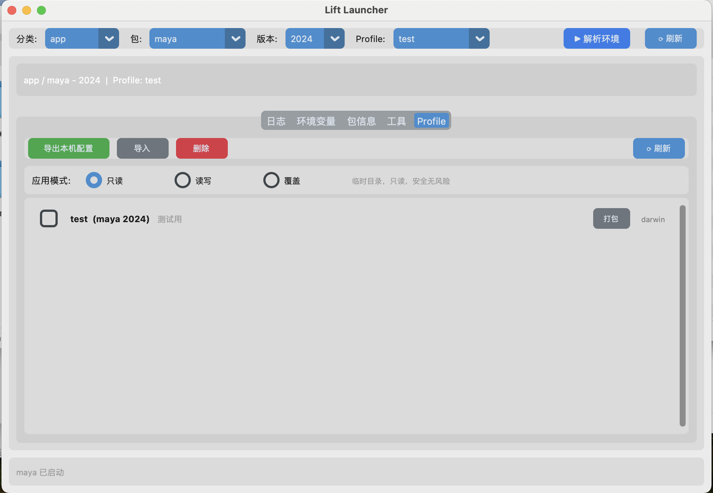

# Lift

轻量级 DCC 启动器，支持 Maya、Houdini 等工具的环境隔离与一键切换。


> ⚠️ 🍎 仅 macOS 测试通过，Windows / Linux 待验证

## 定位

面向影视/游戏行业的 DCC（Digital Content Creation）软件启动器，解决多项目环境冲突问题：

- **环境隔离**: 每个项目拥有独立的插件、脚本、首选项
- **一键切换**: 通过 GUI 选择项目和 DCC，自动解析并启动
- **可定制**： 用户可自定义项目配置，添加插件、脚本、首选项等。

## 架构

```
Zig 启动器 (src/)
  └─ 加载 Python 运行时 → 执行 app/main.py

Python 应用 (app/)
  └─ main.py    # 应用入口

构建脚本 (build.py)
  └─ uv 管理依赖、打包分发
```

## 快速开始

### 构建

```bash
brew install tcl-tk python-tk  # 安装 tkinter 库(仅 macOS)
zig build           # 编译启动器
uv sync             # 同步依赖
uv run build.py     # 构建完整分发包
```

### 运行

```bash
./dist/bin/lift     # 启动 GUI
```

## 配置

在 `packages/` 目录下创建包，GUI 自动发现，以下是package目录结构：
| 目录          | 定位     | 内容                                                         |
| ----------- | ------ | ---------------------------------------------------------- |
| **`app/`**  | DCC 软件 | 指向系统已安装的 Maya、Houdini、Nuke、Blender 等本体。纯引用，不携带载荷。          | 
| **`ext/`**  | 插件扩展 | Arnold、Redshift、Mgear、自定义工具集等。可自包含（带 `.mll`/`.py`）或引用系统插件。 |
| **`int/`**  | 基础环境 | Python 运行时、通用库、跨项目工具脚本。被 `app` 和 `ext` 隐式或显式依赖。            |
| **`proj/`** | 项目配置 | **用户直接选用的入口**。不携带载荷，只声明"这个项目需要哪些 app + ext + int 组合"。      | 


## 平台差异

| 平台 | Python 来源 | 说明 |
|------|-------------|------|
| Linux/macOS | 系统 Python | 运行时动态加载系统 Python |
| Windows | Embeddable | 打包到 `libexec/python3/` |

### 自定义 Python 库路径

通过环境变量 `LIFT_PYTHON_LIB` 可以指定自定义的 Python 库路径：

```bash
# macOS
export LIFT_PYTHON_LIB=/usr/local/lib/python3.11

# Windows
set LIFT_PYTHON_LIB=C:\Python311\libs
```

优先级：
1. 环境变量 `LIFT_PYTHON_LIB`（如果设置）
2. Windows: `libexec/python3/` 下的 embeddable Python
3. Linux/macOS: 系统 Python 库（运行时动态加载）

## 依赖

- Zig 0.16.0+
- uv
- Python 3.10+（仅 Windows 构建时）
- tkinter (仅Linux/MacOS)

## 参考项目

- **[PyStand](https://github.com/skywind3000/PyStand)**: 轻量级 Python 独立部署方案，使用 C++ 语言编写的启动器加载 Python 运行时。
- **[rez-for-projects](https://github.com/mottosso/rez-for-projects)**: Rez 包管理系统的项目示例，展示如何使用 Rez 管理复杂 DCC 项目的环境配置与依赖解析。
